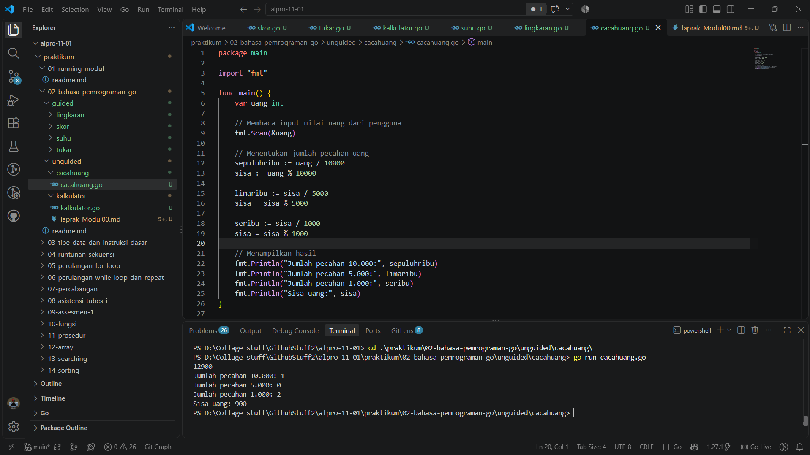
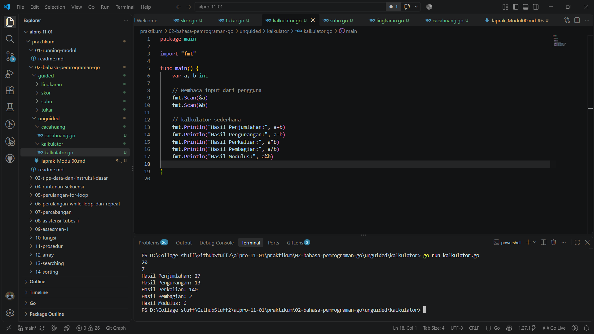

# <h1 align="center">Laporan Praktikum Modul 02 - Bahasa Pemrograman Go</h1>
<p align="center">[Deta Arief Syahputra] - [109092600019]</p>

## Dasar Teori

### A. Bahasa Pemrograman Go
Golang adalah bahasa pemrograman compiled dan statically typed yang dikembangkan oleh Google. Go dirancang agar sederhana, mudah dibaca, cepat dikompilasi, serta memiliki dukungan bawaan untuk konkurensi. Sintaksnya ringkas dibandingkan bahasa seperti C++ atau Java, namun tetap memberikan performa eksekusi yang tinggi karena hasil kompilasinya berupa kode mesin native.

### B. Package dan Struktur Program di Go

#### 1. Pengertian Package main dan func main()
Setiap program Go harus tergabung dalam sebuah package. Deklarasi `package main` menandakan bahwa berkas tersebut adalah program yang dapat dieksekusi secara langsung (bukan berupa library). Fungsi `func main()` adalah titik masuk (entry point) program; ketika program dijalankan, Go akan mengeksekusi kode di dalam `main()` terlebih dahulu.

#### 2. Tipe Data dan Deklarasi Variabel di Go
Go bersifat statically typed, artinya tipe data setiap variabel ditentukan saat kompilasi. Variabel dapat dideklarasikan menggunakan kata kunci `var nama tipe` (contoh: `var r float64`) atau dengan operator deklarasi singkat `:=` yang otomatis menyimpulkan tipe dari nilai yang diberikan (contoh: `total := a + b`). Tipe data dasar yang umum dipakai antara lain `int`, `float64`, dan `string`.

### C. Fungsi Input/Output dan Operator Aritmatika
Paket `fmt` digunakan untuk kebutuhan input dan output. `fmt.Scan(&variabel)` membaca nilai yang diketik pengguna dari standard input, sedangkan `fmt.Println()` dan `fmt.Printf()` digunakan untuk menampilkan hasil ke layar, dengan `Printf` memungkinkan pemformatan seperti pembatasan jumlah angka desimal (`%.2f`). Go juga menyediakan operator aritmatika standar: penjumlahan (`+`), pengurangan (`-`), perkalian (`*`), pembagian (`/`), dan modulus/sisa bagi (`%`). Perlu diperhatikan bahwa pembagian antar bilangan bertipe `int` akan menghasilkan bilangan bulat (desimal dibuang), berbeda dengan pembagian antar `float64` yang menghasilkan nilai pecahan.

## Guided

### 1. lingkaran.go

```go
package main

import "fmt"

func main() {
	var r, luas, keliling float64

	// Membaca input dari pengguna
	fmt.Scan(&r)

	// Menghitung luas dan keliling lingkaran
	luas = 3.14 * r * r
	keliling = 2 * 3.14 * r

	// Menampilkan output
	fmt.Printf("Luas lingkaran: %.2f\n", luas)
	fmt.Printf("Keliling lingkaran: %.2f\n", keliling)

}
```
#### Deskripsi
Program ini membaca jari-jari lingkaran (`r`) sebagai input, lalu menghitung luas (π × r²) dan keliling (2 × π × r) menggunakan nilai π yang didekati dengan 3.14. Karena `r`, `luas`, dan `keliling` bertipe `float64`, hasil perhitungan dapat menyimpan nilai desimal, dan `fmt.Printf` dengan format `%.2f` digunakan agar output ditampilkan dengan dua angka di belakang koma.

### 2. skor.go

```go
package main

import "fmt"

func main() {
	var Nama string
	var SkorMatematika, SkorBahasaInggris int

	// Membaca input dari pengguna
	fmt.Scan(&Nama)
	fmt.Scan(&SkorMatematika)
	fmt.Scan(&SkorBahasaInggris)

	// Menghitung total & rata-rata (pembagian bilangan;

	total := SkorMatematika + SkorBahasaInggris
	ratarata := total / 2

	// Menampilkan output
	fmt.Println(Nama)
	fmt.Println(total)
	fmt.Println(ratarata)

}
```
#### Deskripsi
Program ini membaca nama siswa beserta dua nilai skor (Matematika dan Bahasa Inggris), kemudian menghitung total dan rata-ratanya. Karena `total` dan `ratarata` bertipe `int`, pembagian `total / 2` merupakan pembagian bilangan bulat sehingga bagian desimal hasil rata-rata akan terpotong (dibulatkan ke bawah), bukan dibulatkan secara matematis biasa.

### 3. suhu.go

```go
package main

import "fmt"

func main() {
	var suhu float64

	// Membaca input dari pengguna
	fmt.Scan(&suhu)

	// Konversi suhu
	celcius := (suhu - 32) * 5 / 9
	kelvin := celcius + 273.15
	fahrenheit := celcius*9/5 + 32

	// Menampilkan hasil konversi
	fmt.Printf("Suhu dalam Celsius: %.2f\n", celcius)
	fmt.Printf("Suhu dalam Kelvin: %.2f\n", kelvin)
	fmt.Printf("Suhu dalam Fahrenheit: %.2f\n", fahrenheit)

}
```
#### Deskripsi
Program ini mengasumsikan input `suhu` dalam satuan Fahrenheit, lalu mengonversinya ke Celsius dengan rumus `(F - 32) × 5/9`. Nilai Celsius tersebut kemudian dikonversi lagi ke Kelvin (`C + 273.15`) dan dikembalikan ke Fahrenheit (`C × 9/5 + 32`) sebagai bentuk latihan operasi aritmatika bertipe `float64` beserta pemformatan output dua desimal.

### 4. tukar.go

```go
package main

import "fmt"

func main() {
	var a, b int

	// Membaca input dari;
	fmt.Scan(&a)
	fmt.Scan(&b)

	// menukar a dan b
	a, b = b, a

	// Menampilkan output
	fmt.Println(a)
	fmt.Println(b)

}
```
#### Deskripsi
Program ini membaca dua bilangan bulat `a` dan `b`, kemudian menukar nilai keduanya. Go memungkinkan penukaran nilai dua variabel secara langsung dalam satu baris melalui multiple assignment `a, b = b, a`, tanpa perlu variabel penampung sementara seperti pada bahasa lain.

## Unguided

### 1. cacahuang

```go
package main

import "fmt"

func main() {
	var uang int

	// Membaca input nilai uang dari pengguna
	fmt.Scan(&uang)

	// Menentukan jumlah pecahan uang
	sepuluhribu := uang / 10000
	sisa := uang % 10000

	limaribu := sisa / 5000
	sisa = sisa % 5000

	seribu := sisa / 1000
	sisa = sisa % 1000

	// Menampilkan hasil
	fmt.Println("Jumlah pecahan 10.000:", sepuluhribu)
	fmt.Println("Jumlah pecahan 5.000:", limaribu)
	fmt.Println("Jumlah pecahan 1.000:", seribu)
	fmt.Println("Sisa uang:", sisa)
}
```

##### Output


#### Deskripsi
Program ini menghitung jumlah pecahan uang (10.000, 5.000, dan 1.000) yang dibutuhkan untuk menyusun suatu nominal uang, menggunakan kombinasi operator pembagian bulat (`/`) untuk mencari jumlah lembar dan operator modulus (`%`) untuk mencari sisa yang belum terbagi pada tiap tahap. Pada pengujian dengan input `12900`, program menghasilkan 1 lembar pecahan 10.000, 0 lembar pecahan 5.000, 2 lembar pecahan 1.000, dan sisa uang 900 yang tidak bisa dipecah ke tiga nominal tersebut.

### 2. kalkulator

```go
package main

import "fmt"

func main() {
	var a, b int

	// Membaca input dari pengguna
	fmt.Scan(&a)
	fmt.Scan(&b)

	// kalkulator sederhana
	fmt.Println("Hasil Penjumlahan:", a+b)
	fmt.Println("Hasil Pengurangan:", a-b)
	fmt.Println("Hasil Perkalian:", a*b)
	fmt.Println("Hasil Pembagian:", a/b)
	fmt.Println("Hasil Modulus:", a%b)

}
```

##### Output


#### Deskripsi
Program ini merupakan kalkulator sederhana yang menerima dua bilangan bulat `a` dan `b`, lalu menampilkan hasil penjumlahan, pengurangan, perkalian, pembagian, dan modulus dari kedua bilangan tersebut. Pada pengujian dengan input `a = 20` dan `b = 7`, program menghasilkan penjumlahan 27, pengurangan 13, perkalian 140, pembagian 2 (hasil pembagian bulat), dan modulus 6. Perlu dicatat bahwa karena `a` dan `b` bertipe `int`, program ini akan mengalami *runtime panic* (division by zero) apabila `b` bernilai 0.

## Kesimpulan
Melalui praktikum ini, dapat disimpulkan bahwa Go memiliki struktur program yang sederhana dengan `package main` dan `func main()` sebagai kerangka dasar setiap program yang dapat dieksekusi. Penggunaan paket `fmt` memudahkan proses pembacaan input dan penulisan output, sementara operator aritmatika dasar (`+`, `-`, `*`, `/`, `%`) dapat langsung diterapkan sesuai tipe data yang dideklarasikan, dengan catatan penting bahwa pembagian antar tipe `int` menghasilkan bilangan bulat sedangkan pembagian antar `float64` menghasilkan nilai pecahan. Latihan pada bagian guided (lingkaran, skor, suhu, tukar) dan unguided (cacahuang, kalkulator) menunjukkan penerapan konsep-konsep tersebut pada kasus-kasus sederhana seperti perhitungan geometri, konversi satuan, penukaran nilai variabel, serta pemecahan nominal uang.

## Referensi
1. Donovan, A. A. A., & Kernighan, B. W. (2015). *The Go Programming Language*. Boston: Addison-Wesley Professional. Diakses melalui https://www.gopl.io/
2. The Go Authors. (2026). *Go Documentation*. Diakses melalui https://go.dev/doc/
